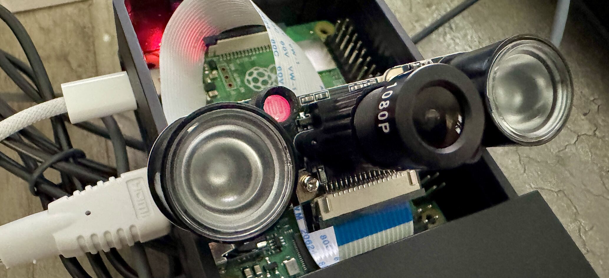
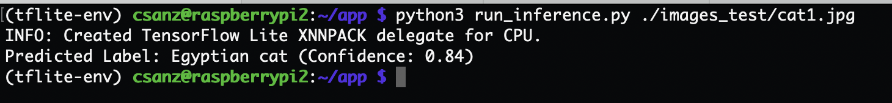

# Raspberry Pi Face Detection



A simple image classification system using MobileNet V2 on Raspberry Pi.

## Setup

1. Clone the repository:

```bash
git clone https://github.com/csanz/rasberrypi-ai-detect.git
cd rasberrypi-ai-detect
```

2. Create a models directory:

```bash
mkdir -p models
```

3. Download MobileNet V2:
   - Visit [MobileNet V2 on Kaggle](https://www.kaggle.com/models/tensorflow/mobilenet-v2)
   - Download the TFLite model
   - Rename it to `mobilenet_v2.tflite` and place it in the `models` directory
   - Download the labels file and rename it to `mobilenet_v2.txt`

## Usage

Run inference on an image:

```bash
python3 run_inference.py path/to/your/image.jpg
```

### Example Output



## License

GPL-3.0 license 
